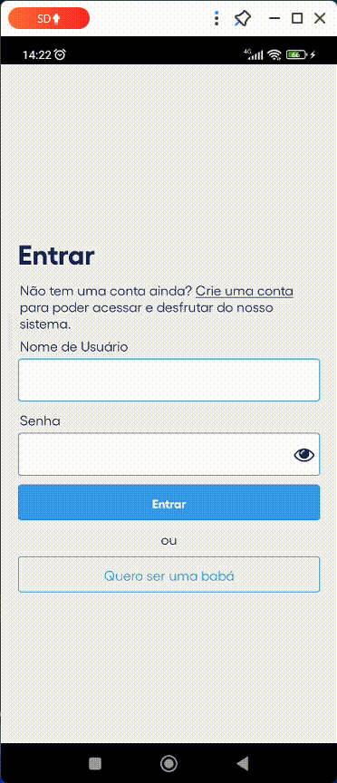
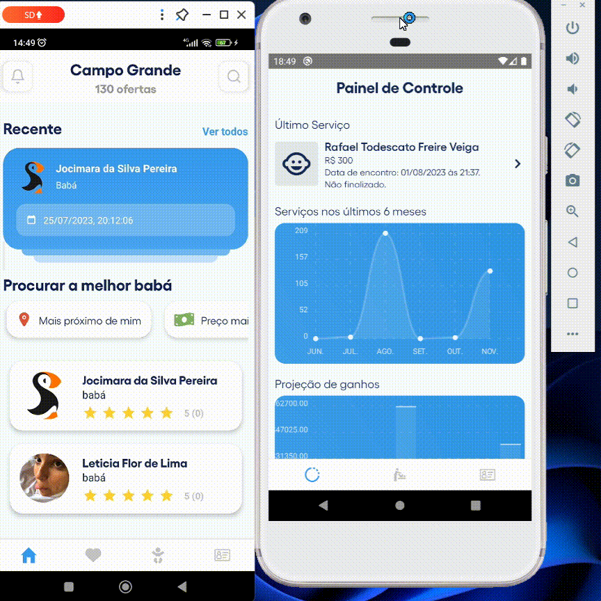
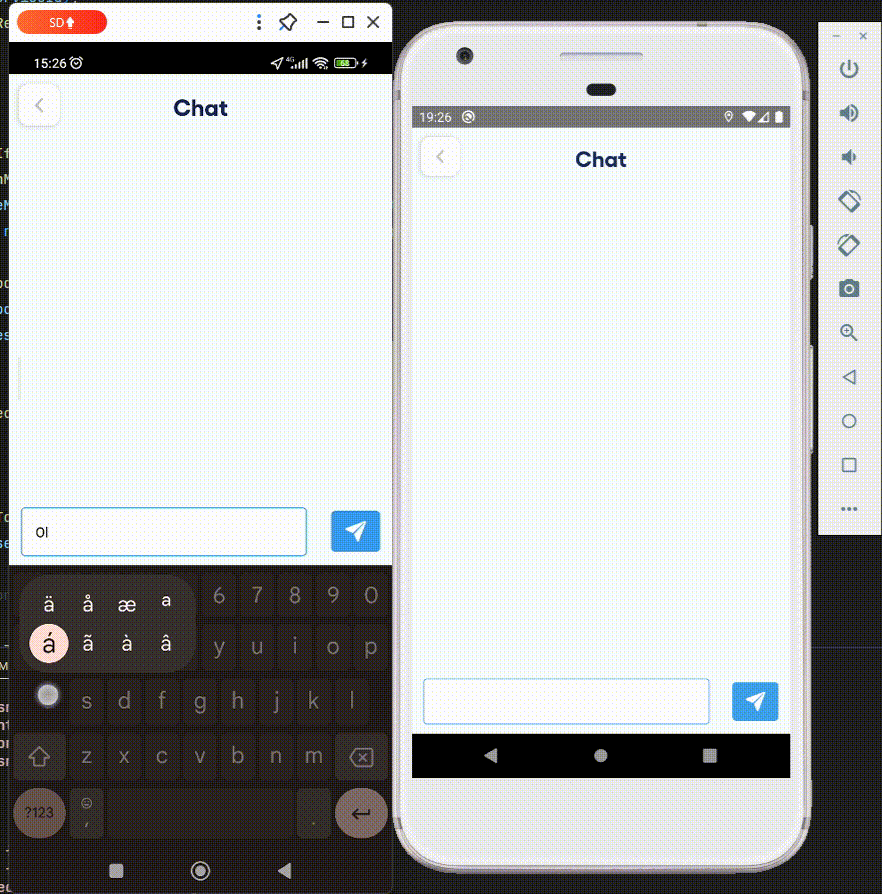

# WheresNanny

## Storytelling para apresentação do projeto fictício

#### Olá 👋👋 Eu preciso muito te fazer uma pergunta... Você conhece alguém que tem filhos e precisou ligar para conhecidos e parentes pra encontrar uma babá ou cuidadora? Se sim, sabe também que muitas vezes é uma trabalheira encontrar uma pessoa verdadeiramente confiável para os nosso bens mais preciosos do mundo e com um preço que caiba no nosso bolso, é claro 😢.

#### E se eu te dissesse que existe uma forma fácil, rápida e confiável de encontrar essas mesmas pessoas; além de tudo isso, num só lugar 😎. Nós da Wheresnanny proporcionamos a você um contato direto com a babá, com os preços mais baixos do mercado, atualmente. Além disso, você não precisa passar seu número: toda a comunicação é feita dentro do próprio aplicativo. Por fim, você pode avaliar o serviço da babá: isso vai nos ajudar a medir as melhores para que os próximos clientes sejam satisfeitos como você!! 🥳🥳

#### Já se sentiu mais aliviado depois dessa notícia, não? Então vem com a gente, fazer parte dessa rede que quer revolucionar o mercado de babás do brasil🩵🤍!!

## Tecnologias Usadas

- React Native (0.71);
- Backend: .NET Framework 6;
- Notificações: Firebase Notifications;
- Chat em tempo real: Socket.io.

Link para o backend: https://github.com/Rafags13/WheresNannyApi

## Telas do aplicativo
### Splash screen

 

### Login

Usuário Comum            |  Babá
:-------------------------:|:-------------------------:
 |  

## Usuário Comum

### Tela inicial do Usuário Comum

 

### Contratando uma Babá

 

### Chat em Tempo Real

 

### Listagem dos Serviços Passados e Recentes

 

### Atualizar Perfil

 

## Babá

### Tela inicial

 

### Listagem dos seus serviços

